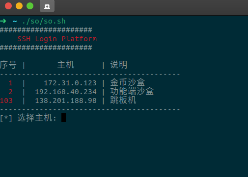

# pf-shell
Linux 下链接远程服务器的工具

## 使用

*注意: 需要提前安装`ssh`、`expect`*

```sh
cp password.example password
./pfs.sh 
```

## password 文件

```
# id:hostname:port:username:password:description
1:127.0.0.1:2221:root:123456:host1

# id:hostname:port:username:private_key:description
2:127.0.0.1:2222:root:/root/.ssh/id_rsa:host2
```

描述:
```
id              -- 序号
hostname        -- 主机地址
username        -- 用户名
password        -- 密码
private_key     -- 私钥文件
description     -- 服务器名称
```

## 运行如图所示

